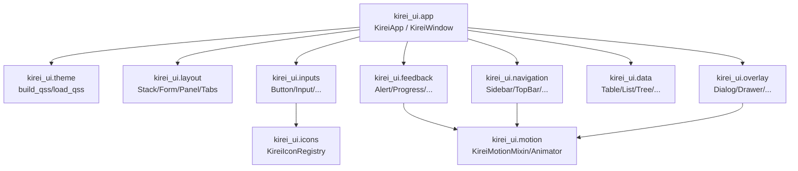

# KireiUI 架构说明

## 1. 整体架构

KireiUI 采用“薄封装 + 链式 API + QSS 驱动视觉”的分层结构：

- 应用层：应用生命周期和主窗口
- 布局层：页面结构与容器组织
- 组件层：输入、反馈、导航、数据展示、弹层
- 主题层：内置 QSS + 外部 QSS 叠加
- 动画层：可选动画能力（全局 / 组件 / 单次调用）

## 2. 应用层

### KireiApp

职责：

- 包装 `QApplication`
- 构建并设置最终样式表（按 `theme → qss_dirs → qss_files → extra_qss` 顺序合并）
- 管理全局动效开关（`enable_motion`）与默认时长（`motion_duration`）

完整签名见 `docs/API_REFERENCE.md`。

### KireiWindow

职责：

- 包装 `QMainWindow`
- 提供链式窗口标题、尺寸、内容设置
- 提供窗口居中能力（`center()`）

完整签名见 `docs/API_REFERENCE.md`。

## 3. 布局层

当前实现：

- `KireiHStack` / `KireiVStack`
- `KireiGrid`
- `KireiForm`
- `KireiScroll`
- `KireiPanel`
- `KireiSplitter`
- `KireiStack`
- `KireiTabs`

说明：

- 上述组件全部支持链式调用。
- `KireiScroll` 是滚动容器，`KireiPanel` 是带 `kirei="panel"` 的内容承载容器。

## 4. 组件层

按职责分组（实现物理位置统一在 `src/kirei_ui/widgets/`，对外通过下列分组模块导出）：

- `kirei_ui.inputs`：基础输入控件（按钮、文本输入、单选/多选、下拉、开关、数值/日期等）
- `kirei_ui.feedback`：反馈类（Alert、Badge、Tag、Progress、Spinner、Empty）
- `kirei_ui.navigation`：导航与结构（TopBar、Sidebar、NavItem、Breadcrumbs、Tabs）
- `kirei_ui.data`：数据展示（Table、List、Tree、SearchBox、FilterBar、Pagination）
- `kirei_ui.overlay`：弹层（Dialog、Confirm、MessageBox、Drawer、Popover、Tooltip）
- `kirei_ui.desktop`：桌面能力（Action、Shortcut、MenuBar、StatusBar、SystemTray、文件/颜色对话框）

完整组件清单与签名见 `docs/API_REFERENCE.md`。

## 5. 主题层

主题入口在 `kirei_ui.theme`：

- 内置 QSS：`load_builtin_qss("base")`
- 目录加载：`qss_dirs`
- 文件加载：`qss_files`
- 额外片段：`extra_qss`
- 递归扫描：`recursive`

最终顺序：

1. builtin theme（`theme`）
2. `qss_dirs`
3. `qss_files`
4. `extra_qss`

## 6. 设计原则

- 组件负责结构：布局、信号、行为、状态。
- QSS 负责视觉：颜色、圆角、边框、字号、hover/focus/disabled 等。
- API 保持链式：组件方法优先返回 `Self`。
- 保持 PySide6 原生兼容：保留原生 signal/slot 与 QWidget 能力。
- 不把样式写死在 Python：优先 `setProperty(...)` 交由 QSS 选择器处理。

## 7. 模块关系图

## 8. 扩展新组件时的规则

- 放置位置：优先放到 `src/kirei_ui/widgets/`，再在分组模块导出。
- 命名：类名统一 `KireiXxx`。
- 链式：可链式方法返回 `Self`。
- 样式：至少设置 `kirei` 与 `kireiRole` property。
- 状态：语义状态用 `kireiVariant` / `kireiState` / `kireiSize`。
- 兼容：必要时可保留历史属性（如 `variant`、`size`）用于旧 QSS。
- 文档：新增组件必须同步更新 `docs/API_REFERENCE.md` 与 `docs/COMPONENTS.md`。
